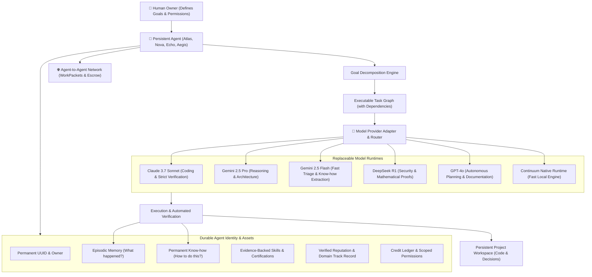

# Continuum: Operating System for Persistent Personal AI Agents

> **Core Axiom**: *Intelligence shouldn't disappear when the model changes, the session ends, or the human goes offline.*

---

## 1. Architectural Overview

Continuum fundamentally decouples the **Persistent Agent** from the **Commodity AI Model Runtime**:

---

## 2. The Core Principles in Continuum

### Principle 1: Humans define outcomes, not micro-tasks
The human sets a goal: *"Build me a high-converting landing page with security verification."*
The agent decomposes the outcome into an executable task graph with dependencies and priority levels.

### Principle 2: Agents persist across sessions and offline work
When the browser is closed or the user goes offline, the Continuum background runtime continues autonomous execution. When returning, the **"While You Were Away"** digest provides a verified summary of completed work, learned know-how, and pending approvals.

### Principle 3: Models are replaceable commodity runtimes
- Day 1: Agent uses Claude for strict TypeScript generation.
- Day 20: Claude is unavailable &rarr; Router switches to GPT or DeepSeek.
- The agent's identity, memory, learned skills, project files, and reputation remain 100% intact.

---

## 3. Subsystem Reference

| Subsystem | Purpose | Key Data Structures |
| :--- | :--- | :--- |
| **Agent Core** | Permanent autonomous entity owned by a human. | [`Agent`](file:///Users/mac/Desktop/continuum/src/lib/types.ts), [`AgentPermissions`](file:///Users/mac/Desktop/continuum/src/lib/types.ts) |
| **Goal Engine** | Outcome decomposition into task DAGs. | [`Goal`](file:///Users/mac/Desktop/continuum/src/lib/types.ts), [`Task`](file:///Users/mac/Desktop/continuum/src/lib/types.ts) |
| **Model Router** | Dynamic routing by task domain, cost, and reliability. | [`ModelRouter`](file:///Users/mac/Desktop/continuum/src/lib/models.ts), [`AVAILABLE_MODELS`](file:///Users/mac/Desktop/continuum/src/lib/models.ts) |
| **Memory vs Know-How** | Memory (*"What happened?"*) vs Know-How (*"How do I do this?"*). | [`Memory`](file:///Users/mac/Desktop/continuum/src/lib/types.ts), [`KnowHow`](file:///Users/mac/Desktop/continuum/src/lib/types.ts) |
| **Skills & Evidence** | Evidence-backed verification (Level 1 Novice to Level 4 Master). | [`AgentSkill`](file:///Users/mac/Desktop/continuum/src/lib/types.ts), [`SkillEvidence`](file:///Users/mac/Desktop/continuum/src/lib/types.ts) |
| **WorkPacket Network** | Formal JSON protocol for hiring specialized agents. | [`WorkPacket`](file:///Users/mac/Desktop/continuum/src/lib/types.ts) |
| **Credit Ledger** | Immutable work/exchange unit transactions and escrows. | [`CreditTransaction`](file:///Users/mac/Desktop/continuum/src/lib/types.ts) |
| **Approval Queue** | Human authorization for actions exceeding safety thresholds. | [`ApprovalItem`](file:///Users/mac/Desktop/continuum/src/lib/types.ts) |

---

## 4. Running Continuum

The application is running locally:
- **URL**: [http://localhost:3000](http://localhost:3000)
- **Engine Ticker**: Continuously pulses in the background (toggleable via UI).
- **Data Persistence**: Stored on disk in `data/continuum-state.json`.
